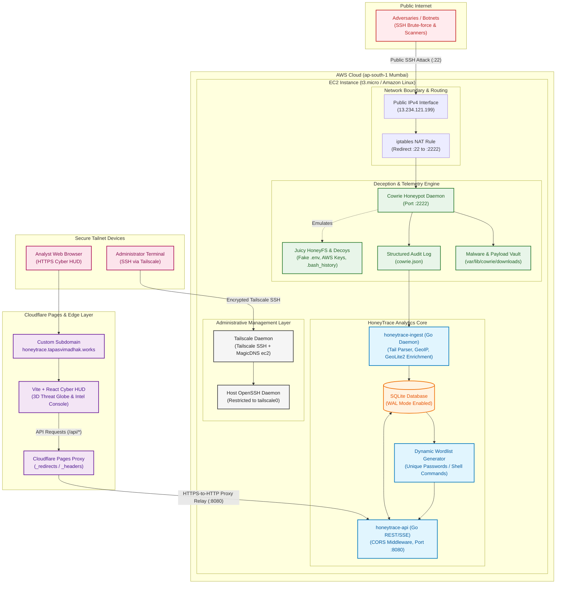

# HoneyTrace

HoneyTrace is a honeypot intelligence platform that captures real attack traffic, correlates host and network telemetry, enriches the alerts, and turns the output into analyst-readable triage.

<sub>**Project inspired by [NetworkShard](https://networkshard.com)**</sub>

---

## System Architecture



---

## Live Data Retrieval Architecture

HoneyTrace uses a hybrid edge-proxy architecture that connects public dashboard deployments to the AWS sensor without exposing database credentials or encountering browser security restrictions:

1. **Edge Reverse Proxy (`_redirects` / `_headers`)**:
   - The React single-page application is hosted on **Cloudflare Pages** with unlimited free bandwidth and zero build limits.
   - When the dashboard requests `/api/v1/telemetry/stats` or `/api/v1/ai/chat`, Cloudflare's edge network proxies the request directly to the AWS EC2 instance at `http://13.234.121.199:8080/api/*`.
   - **Zero Mixed-Content Blocking**: Browsers communicate exclusively via HTTPS with Cloudflare Pages, preventing mixed-content blocking.
   - **Zero CORS Bottlenecks**: API calls are same-origin on the client domain.
2. **AWS EC2 Ingress Security (`honeytrace-sg`)**:
   - Port `8080` is authorized for inbound REST queries.
   - Port `22` forwards attacker traffic directly into the Cowrie honeypot decoy engine via iptables NAT redirection.
   - Host administrative SSH access is restricted exclusively to the private **Tailscale Mesh**.
3. **Server-Side AI Secrecy & AbuseIPDB Integration**:
   - The Groq and AbuseIPDB API keys are stored strictly on the server in `/opt/honeytrace/.env` (`chmod 600`), completely shielded from client-side bundles and Git tracking.

---

## Key Platform Capabilities

### 1. 3D Cyber Threat Globe
- **Real-Time Attack Visualizer**: Renders global threat origin points, vertical intensity pillars, and ballistic trajectory arcs terminating at the Mumbai sensor node.
- **Top 15 Hotspot Focus**: Eliminates visual clutter by intelligently prioritizing the highest-volume attack origin clusters.
- **Single-IP Graph Isolation**: Click any IP in the *Top Attackers* or *Live Stream* table to isolate that specific attacker's trajectory on the 3D Earth while smoothly auto-panning the camera.
- **Expandable HUD & Full Globe Mode**: Collapsible floating glass panels and 1-click **Full Globe View** for unobstructed visualization.

### 2. Breach Intelligence & Infiltration Tracker
- **Dwell Time & Shell Telemetry**: Tracks attackers who successfully compromised credentials (e.g. `root:admin`, `root:123456`), measuring session duration and executed command counts.
- **Top Infiltrator Attribution**: Ranks aggressive breaching subnets (such as Indonesian botnets and Peru scan waves).
- **AbuseIPDB Badges**: Real-time threat confidence ratings and ISP attribution popovers for every infiltrator.

### 3. Dynamic Attacker Wordlist Engine
- **Live Password Harvester**: Aggregates and dedupes all credentials submitted across 41,400+ attacks into a real-time dictionary of **6,467+ unique passwords**.
- **1-Click Text Stream (`.txt`)**: Instant dictionary export for defensive password auditing and SecLists integration.

### 4. Static Malware Forensics & Hex Inspector
- **Disassembly & Magic Byte Analyzer**: Inspects quarantined ELF/script binaries on disk (`94f2e4...` [30.3 MB CoinMiner], `23e4b2...` [7.9 MB Botnet Dropper]).
- **IOC String Extractor**: Extracts printable ASCII strings (`/lib64/ld-linux-x86-64.so.2`, `libpam.so.0`, `CPUAffinity`).
- **VirusTotal Integration**: Direct 1-click hash search verifying threat signatures (e.g. `CoinMiner/Linux.Agent.30304472`).

### 5. Interactive TTY Keystroke Replayer
- **Cowrie TTY Struct Unpacker**: Parses raw binary session streams (`<iLiiLL` header format) into timed terminal frames.
- **VCR Player Interface**: Full playback controls (`Play`, `Pause`, `Restart`, `Speed 1x/2x/5x/10x`, interactive timeline scrubber).

### 6. Blue Team SOC Intel Console & AI Analyst
- **Groq LPU Acceleration (`openai/gpt-oss-120b`)**: Sub-second threat intelligence synthesis.
- **Executive Incident Briefings**: Structured threat landscape reports with MITRE ATT&CK mapping and campaign attribution.
- **Automated Mitigation Playbooks**: Generates copyable, production-ready `iptables`, `ufw`, and `fail2ban` quarantine rules.
- **Deep RAG Context Retrieval**: Automatically enriches queries with exact SQLite event records, binary file sizes, and command logs.
- **Multi-Turn Conversational Memory**: Retains conversation history across follow-up queries.
- **Markdown Compiler (`CyberMarkdown`)**: Renders cyber tables, code blocks with 1-click copy, and high-contrast badges without raw syntax symbols.

---

## MITRE ATT&CK Matrix Coverage

| Technique ID | Technique Name | Observed Sensor Evidence |
| :--- | :--- | :--- |
| **`T1110.001`** | **Password Guessing / Spraying** | 41,400+ SSH attempts testing 6,460+ unique passwords (e.g. Santa Clara `143.198.98.252` 30.4k spray). |
| **`T1059.004`** | **Unix Shell Execution** | 166 commands executed (`uname -s -v -n -m`, `chmod +x sshd; nohup`, `echo -e "\x6F\x6B"`). |
| **`T1105`** | **Ingress Tool Transfer** | 123.2 MB of malicious binaries dropped via SCP/SFTP/HTTP. |
| **`T1496`** | **Resource Hijacking (Cryptojacking)** | 30.3 MB ELF binary (`94f2e4...`) executed with 50+ mining pool IPs to mine Monero. |
| **`T1090`** | **Proxy / SSH Direct-TCPIP Tunneling** | Forwarding attempts probing internal ports and web services. |
| **`T1082`** | **System Information Discovery** | Multi-line shell scripts testing kernel version, CPU topology, GPU presence, and shell filtering. |

---

## Project Structure

```
HoneyTrace/
├── api/                        # Go REST API & AI Service
│   ├── ai.go                   # Groq LPU Client, RAG Context Retriever & Multi-turn Memory
│   ├── routes.go               # HTTP Endpoints (Telemetry, AI Triage, Wordlists, Payloads)
│   ├── store.go                # SQLite Data Layer, MaxMind GeoIP2 Resolver, TTY Parser
│   ├── models.go               # Data Structures & JSON Models
│   └── main.go                 # Server Bootstrap & CORS Middleware
├── dashboard/                  # React 18 + Vite + Tailwind CSS Frontend
│   ├── src/
│   │   ├── components/
│   │   │   ├── CyberGlobe.tsx  # 3D Starfield Globe with IP Trajectory Focus
│   │   │   ├── CyberMarkdown.tsx # Custom Cyber GFM Markdown Compiler
│   │   │   └── HoneyTraceLogo.tsx # Ultra-Minimalist Geometric Vector Glyph
│   │   ├── routes/
│   │   │   ├── Globe.tsx       # 3D Threat Visualizer & Collapsible HUD
│   │   │   ├── Breaches.tsx    # Infiltration Session Intelligence
│   │   │   ├── CapturedAttacks.tsx # Password Wordlist Generator & Shell Logs
│   │   │   ├── Payloads.tsx    # Static Malware Analysis & Hex Dump Modal
│   │   │   ├── TerminalViewer.tsx # Interactive TTY Keystroke Player
│   │   │   └── Intel.tsx       # Blue Team SOC Defense Hub & AI Assistant
│   │   └── hooks/
│   │       └── useTelemetry.ts # Telemetry Polling & Live Feed State
│   ├── public/
│   │   ├── favicon.svg         # Minimalist Vector Favicon
│   │   ├── logo.svg            # Branding Asset
│   │   └── _redirects          # SPA & Netlify Edge Proxy Rules
│   └── vite.config.ts          # Vite Build Configuration
├── docs/                       # Architectural Assets & Diagrams
│   ├── architecture.mmd        # Mermaid Architecture Definition
│   └── assets/
│       ├── architecture.svg    # Vector Architecture Diagram
│       └── architecture.png    # Raster High-Resolution Architecture Diagram
├── ingest/                     # Log Tailer & Event Normalizer (Go)
├── infra/                      # Cloud Architecture, Bootstrap & Tooling
│   ├── bootstrap/              # Tailscale & Honeypot Provisioning Scripts
│   └── tools/                  # Credential Scrubbing & Log Sanitation Scripts
├── netlify.toml                # Netlify Build, Proxy & SPA Fallback Config
└── package.json                # Root Workspace Commands
```

---

## Quickstart

### Prerequisites
- **Go 1.22+**
- **Node.js 20+ & npm**
- **Tailscale** (for private administrative SSH access)

### 1. Local Development
```bash
# Clone repository
git clone https://github.com/TapasviMadhak/HoneyTrace.git
cd HoneyTrace

# Install dashboard dependencies
npm --prefix dashboard install

# Start development server
npm run dev
```
Open `http://localhost:5173` in your browser.

### 2. Backend Service Setup
```bash
# Create server-side environment file (git-ignored)
echo "GROQ_API_KEY=your_groq_api_key" > .env

# Build and run API
go run ./api
```

## Security & Community
- **Security Policy**: See [SECURITY.md](SECURITY.md) for vulnerability reporting procedures.
- **Code of Conduct**: See [CODE_OF_CONDUCT.md](CODE_OF_CONDUCT.md) for community guidelines.
- **License**: This project is licensed under the MIT License — see the [LICENSE](LICENSE) file for details.
