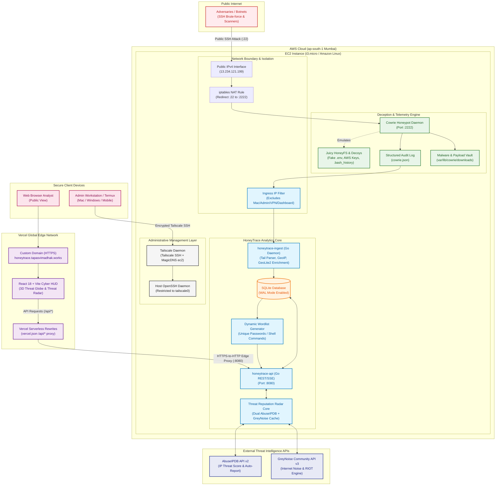

# HoneyTrace

HoneyTrace is an enterprise-grade cyber threat intelligence platform that captures real attack traffic, correlates host and network telemetry, enriches alerts with dual threat intelligence feeds (**AbuseIPDB** & **GreyNoise**), and turns raw honeypot data into actionable analyst triage.

🌐 **Live Cyber HUD**: [https://honeytrace.tapasvimadhak.works](https://honeytrace.tapasvimadhak.works)  
<sub>**Project inspired by [NetworkShard](https://networkshard.com)**</sub>

---

## System Architecture



---

## Live Data Retrieval & Edge Architecture

HoneyTrace uses a high-performance edge-proxy architecture that connects public dashboard deployments to the AWS sensor without exposing server credentials:

1. **Vercel Serverless Edge Proxy (`vercel.json`)**:
   - The React SPA is delivered globally via **Vercel's Edge Network** with automatic SSL/TLS on `honeytrace.tapasvimadhak.works`.
   - Client queries to `/api/*` are securely proxied over HTTPS to the Go REST API running on AWS EC2 (`13.234.121.199:8080`).
   - **Zero Mixed-Content Blocking & Zero CORS Overhead**: Client browsers communicate exclusively via HTTPS.
2. **Ingress Filtering & Isolation**:
   - **Strict Administrative IP Filter**: Excludes loopback (`127.0.0.1`), private subnets (`10.0.0.0/8`, `192.168.0.0/16`, `172.16.0.0/12`), Carrier-Grade NAT / Tailscale (`100.64.0.0/10`), and admin workstations so dashboard visits are never ingested or counted as attacks.
   - **Port 22 Redirection**: Adversaries on port 22 are silently redirected via Linux kernel `iptables` NAT into the Cowrie honeypot on port 2222.
   - **Tailscale Encrypted Management**: Real OpenSSH host administration is restricted exclusively to the private Tailscale interface.
3. **Server-Side API Key Secrecy**:
   - Groq AI, AbuseIPDB, and GreyNoise API keys are stored strictly on the server in `.env` (`chmod 600`), completely shielded from client-side bundles and Git.

---

## Key Platform Capabilities

### 1. 3D Cyber Threat Globe
- **Real-Time Attack Trajectories**: Renders global threat origin points, vertical intensity pillars, and ballistic arcs terminating at the Mumbai sensor node.
- **Top 15 Hotspot Focus**: Eliminates clutter by intelligently prioritizing the highest-volume attack clusters.
- **Single-IP Trajectory Isolation**: Click any IP to isolate its trajectory path on the 3D globe with auto-camera pan.

### 2. Threat Reputation Radar (`/radar`)
- **Dual Threat Feeds**: Real-time cross-correlation between **AbuseIPDB** threat confidence (0–100%) and **GreyNoise** mass background noise detection.
- **Interactive Deep Lookup**: Enter any IP to inspect dual threat scores, ISP/hosting network, usage type, and RIOT benign status.
- **1-Click Smooth Inspect**: Clicking "Deep Inspect" on any table row smoothly scrolls the view directly to the dual analysis console.
- **Dedicated Directory Filters**:
  - 🔥 **Top 10 Attackers**: Highest-volume adversaries sorted by attack count.
  - 🚨 **Critical IPs (≥75%)**: High-severity threats with Abuse Confidence $\ge 75\%$.
  - ⚡ **Live Feed (10 Unique)**: The 10 latest incoming connection IPs with **guaranteed zero duplicate repeats**.
  - 🌐 **All Observed**: Full database threat directory.

### 3. Breach Intelligence & Infiltration Tracker
- **Dwell Time & Shell Telemetry**: Tracks attackers who successfully compromised credentials (e.g. `root:admin`), measuring session duration and command count.
- **Automated Threat Reporting**: Automatically reports confirmed breach sessions to AbuseIPDB under Category 18 (Brute-Force) and Category 22 (SSH).

### 4. Dynamic Attacker Wordlist Engine
- **Live Password Harvester**: Aggregates and dedupes all submitted passwords into a real-time dictionary of **6,467+ unique passwords**.
- **1-Click Text Stream (`.txt`)**: Instant dictionary export for defensive password auditing and SecLists integration.

### 5. Static Malware Forensics & Hex Inspector
- **Disassembly & Magic Byte Analyzer**: Inspects quarantined ELF binaries on disk (`94f2e4...` [30.3 MB CoinMiner], `23e4b2...` [7.9 MB Botnet Dropper]).
- **IOC String Extractor**: Extracts printable ASCII strings (`/lib64/ld-linux-x86-64.so.2`, `libpam.so.0`, `CPUAffinity`).
- **VirusTotal Integration**: Direct 1-click hash search verifying threat signatures (e.g. `CoinMiner/Linux.Agent.30304472`).

### 6. Interactive TTY Keystroke Replayer
- **Cowrie TTY Struct Unpacker**: Parses raw binary session streams (`<iLiiLL` header format) into timed terminal frames.
- **VCR Player Interface**: Full playback controls (`Play`, `Pause`, `Restart`, `Speed 1x/2x/5x/10x`, interactive scrubber).

### 7. Blue Team SOC Intel Console & AI Analyst
- **Groq LPU Acceleration (`openai/gpt-oss-120b`)**: Sub-second threat intelligence synthesis.
- **Executive Incident Briefings**: Structured threat landscape reports with MITRE ATT&CK mapping and campaign attribution.
- **Automated Mitigation Playbooks**: Generates copyable, production-ready `iptables`, `ufw`, and `fail2ban` quarantine rules.

---

## MITRE ATT&CK Matrix Coverage

| Technique ID | Technique Name | Observed Sensor Evidence |
| :--- | :--- | :--- |
| **`T1110.001`** | **Password Guessing / Spraying** | 44,300+ SSH attempts testing 6,460+ unique passwords (e.g. Santa Clara `143.198.98.252` 30.4k spray). |
| **`T1059.004`** | **Unix Shell Execution** | 166 commands executed (`uname -s -v -n -m`, `chmod +x sshd; nohup`, `echo -e "\x6F\x6B"`). |
| **`T1105`** | **Ingress Tool Transfer** | 123.2 MB of malicious binaries dropped via SCP/SFTP/HTTP. |
| **`T1496`** | **Resource Hijacking (Cryptojacking)** | 30.3 MB ELF binary (`94f2e4...`) executed with 50+ mining pool IPs to mine Monero. |
| **`T1090`** | **Proxy / SSH Direct-TCPIP Tunneling** | Forwarding attempts probing internal ports and web services. |
| **`T1082`** | **System Information Discovery** | Multi-line shell scripts testing kernel version, CPU topology, GPU presence, and shell filtering. |

---

## Project Structure

```
HoneyTrace/
├── api/                        # Go REST API & Threat Intelligence Service
│   ├── abuseipdb.go            # AbuseIPDB API Client & In-Memory 6h Cache
│   ├── greynoise.go            # GreyNoise Community API Client & Cache
│   ├── ai.go                   # Groq LPU Client, RAG Context Retriever & Memory
│   ├── routes.go               # HTTP Endpoints (Telemetry, Threat Radar, AI Triage, Payloads)
│   ├── store.go                # SQLite Data Layer, Ingress Filter, GeoIP2 Resolver, TTY Parser
│   ├── models.go               # Data Structures & JSON Models
│   └── main.go                 # Server Bootstrap, CORS & Static SPA Fallback Server
├── dashboard/                  # React 18 + Vite + Tailwind CSS Frontend
│   ├── src/
│   │   ├── components/
│   │   │   ├── CyberGlobe.tsx  # 3D Starfield Globe with IP Trajectory Focus
│   │   │   ├── CyberMarkdown.tsx # Custom Cyber GFM Markdown Compiler
│   │   │   ├── AbuseBadge.tsx  # Glowing Reputation Badge & Metadata Popover
│   │   │   └── HoneyTraceLogo.tsx # Ultra-Minimalist Geometric Vector Glyph
│   │   ├── routes/
│   │   │   ├── Globe.tsx       # 3D Threat Visualizer & Collapsible HUD
│   │   │   ├── ThreatRadar.tsx # Dual Threat Intelligence Radar & Reputation Directory
│   │   │   ├── Breaches.tsx    # Infiltration Session Intelligence
│   │   │   ├── CapturedAttacks.tsx # Password Wordlist Generator & Shell Logs
│   │   │   ├── Payloads.tsx    # Static Malware Analysis & Hex Dump Modal
│   │   │   ├── TerminalViewer.tsx # Interactive TTY Keystroke Player
│   │   │   └── Intel.tsx       # Blue Team SOC Defense Hub & AI Assistant
│   │   └── hooks/
│   │       └── useTelemetry.ts # Telemetry Polling & Live Feed State
│   ├── public/
│   │   ├── favicon.svg         # Minimalist Vector Favicon
│   │   ├── logo.svg            # Branding Asset
│   │   └── _headers            # Security & CSP Headers
│   ├── vercel.json             # Vercel Serverless Edge API Rewrites & SPA Routing
│   └── vite.config.ts          # Vite Build Configuration
├── docs/                       # Architectural Assets & Diagrams
│   ├── ARCHITECTURE.md         # Comprehensive System Architecture Guide
│   └── architecture.mmd        # Mermaid Architecture Definition
├── ingest/                     # Log Tailer & Event Normalizer (Go)
│   ├── abuseipdb.go            # Automated Attacker Threat Reporter
│   └── cowrie_tailer.go        # Real-time JSON Log Parser & Ingress Filter
├── infra/                      # Cloud Architecture, Bootstrap & Tooling
│   ├── bootstrap/              # Tailscale & Honeypot Provisioning Scripts
│   └── tools/                  # Credential Scrubbing & Log Sanitation Scripts
└── package.json                # Root Workspace Commands
```

---

## Quickstart

### Prerequisites
- **Go 1.22+**
- **Node.js 20+ & npm**
- **Tailscale** (for private administrative SSH access)

### 1. Local Development
```bash
# Clone repository
git clone https://github.com/TapasviMadhak/HoneyTrace.git
cd HoneyTrace

# Install dashboard dependencies
npm --prefix dashboard install

# Start development server
npm run dev
```
Open `http://localhost:5173` in your browser.

### 2. Backend Service Setup
```bash
# Create server-side environment file (git-ignored)
cat << 'EOF' > .env
GROQ_API_KEY=your_groq_api_key
ABUSEIPDB_API_KEY=your_abuseipdb_api_key
GREYNOISE_API_KEY=your_greynoise_api_key
HONEYTRACE_IGNORE_IPS=your_admin_ip
EOF

# Build and run API
go run ./api
```

---

## Security & Community
- **Security Policy**: See [SECURITY.md](SECURITY.md) for vulnerability reporting procedures.
- **Code of Conduct**: See [CODE_OF_CONDUCT.md](CODE_OF_CONDUCT.md) for community guidelines.
- **License**: This project is licensed under the MIT License — see the [LICENSE](LICENSE) file for details.
