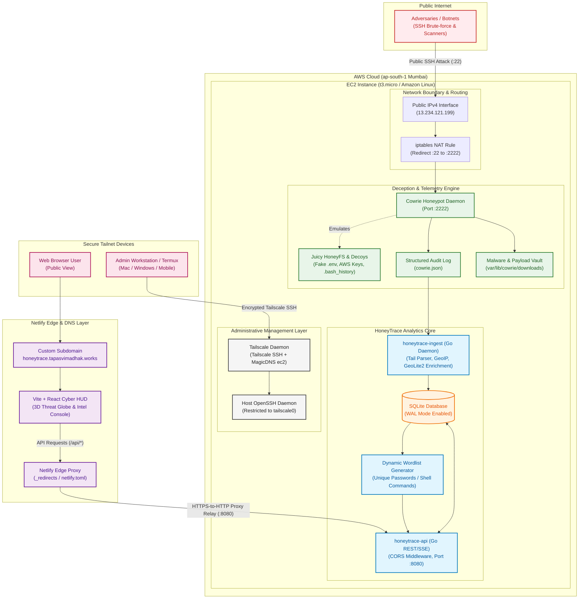

# HoneyTrace System Architecture

HoneyTrace is an end-to-end cyber threat intelligence platform that captures real attack traffic, correlates host and network telemetry, enriches the alerts, and turns the output into analyst-readable triage.

**Project inspired by [NetworkShard](https://networkshard.com)**

---

## System Architecture

---

## Core Pipeline Subsystems

### 1. Ingress & Deception Subsystem
- **Public Bait SSH Interface (Port 22)**: Public AWS IPv4 interface routes inbound port 22 traffic via iptables PREROUTING NAT redirection directly to the unprivileged Cowrie daemon on port 2222.
- **Deception Shell & Fake Filesystem**: Simulates a vulnerable Linux root environment with realistic honey tokens (`.bash_history`, fake AWS credentials, environment configs).
- **Artifact Quarantine Vault**: Intercepts and archives inbound attacker payload binaries directly to disk (`var/lib/cowrie/downloads/`).

### 2. Analytics & Ingest Engine (Go)
- **Multi-File Event Tailer**: Continuously monitors rotated Cowrie JSON logs with checkpoint tracking.
- **MaxMind GeoIP2 Resolution**: Enriches attacker IPv4 addresses with geographic country codes, city names, and latitude/longitude coordinates.
- **WAL-Mode SQLite Persistence**: High-throughput storage preserving over 41,400 raw attack records, session durations, and sprayed passwords.

### 3. API & AI SOC Intelligence Layer
- **Go REST Service (`:8080`)**: Exposes structured telemetry, 3D globe coordinates, quarantined binary hex inspection, and wordlist streams.
- **Groq LPU Acceleration**: Powers the AI Incident Response Commander with real-time RAG context retrieval and MITRE ATT&CK campaign mapping.

### 4. Edge Distribution & Administration
- **Netlify Edge Reverse Proxy**: Relays public HTTPS dashboard traffic to the AWS EC2 API endpoint (`:8080`), eliminating CORS and mixed-content issues.
- **Tailscale Encrypted Mesh**: Restricts administrative OpenSSH access exclusively to authorized Tailnet keys.
