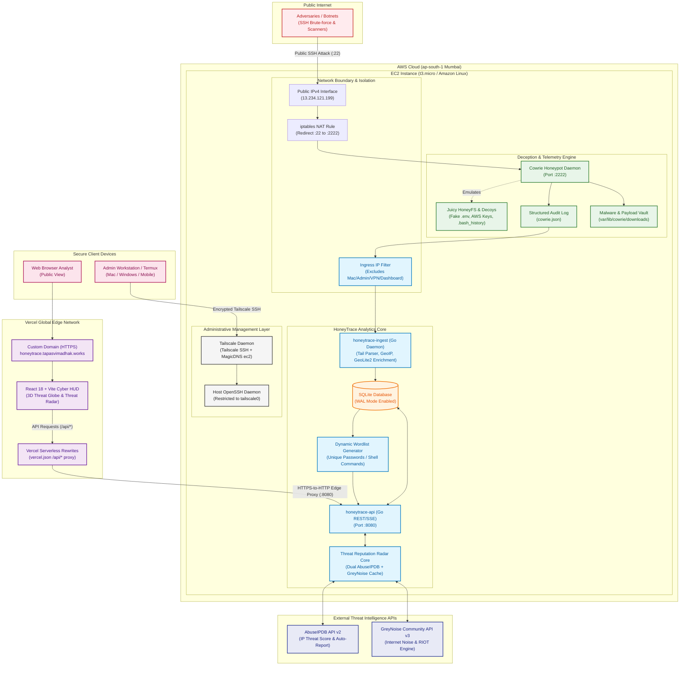

# HoneyTrace System Architecture

HoneyTrace is an end-to-end cyber threat intelligence platform that captures real attack traffic, correlates host and network telemetry, enriches alerts with dual threat intelligence feeds (**AbuseIPDB** & **GreyNoise**), and turns the output into analyst-readable triage.

**Project inspired by [NetworkShard](https://networkshard.com)**

---

## System Architecture

---

## Core Pipeline Subsystems

### 1. Ingress & Deception Subsystem
- **Public Port 22**: Redirected via Linux `iptables` NAT PREROUTING to Cowrie (`:2222`).
- **Ingress Isolation Filter**: Excludes loopback (`127.0.0.1`), private networks (`10.0.0.0/8`, `192.168.0.0/16`, `172.16.0.0/12`), Carrier-Grade NAT / Tailscale (`100.64.0.0/10`), and admin workstations so dashboard views are never counted as attacks.
- **HoneyFS Decoys**: HoneyFS emulates realistic Ubuntu filesystem trees with honeypot credentials (`.env`, `id_rsa`, AWS secret keys).

### 2. Analytics & Threat Intelligence Radar
- **MaxMind GeoIP2**: In-memory binary MMDB lookup for physical latitude, longitude, ISO country code, and city.
- **AbuseIPDB Threat Engine**: Automated confidence reputation scores (0–100%) and automated attacker reporting on breach events.
- **GreyNoise Noise Engine**: Classifies internet background noise (`noise: true`) vs targeted custom exploits, and verifies benign services with RIOT.
- **Dynamic Attacker Wordlist**: Aggregates attacker brute-force credentials and shell commands into live downloadable `.txt` files.

### 3. Frontend & Global Edge Delivery
- **Vercel Edge Network**: Hosted at `https://honeytrace.tapasvimadhak.works` with zero-config HTTPS and global low-latency CDN.
- **API Edge Proxy (`vercel.json`)**: Serverless rewrites relay `/api/*` requests over HTTPS directly to the AWS EC2 Go backend (`:8080`).
- **Live Threat Radar (`/radar`)**: Interactive deep lookup, 1-click smooth inspect, and dedicated filter tabs (Top 10 Attackers, Critical Threats $\ge 75\%$, Live Feed 10 Unique non-repeating IPs).
